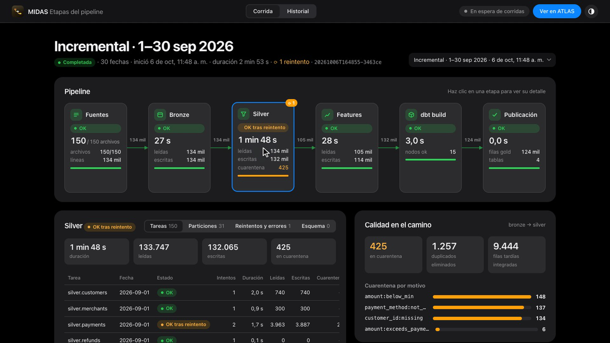
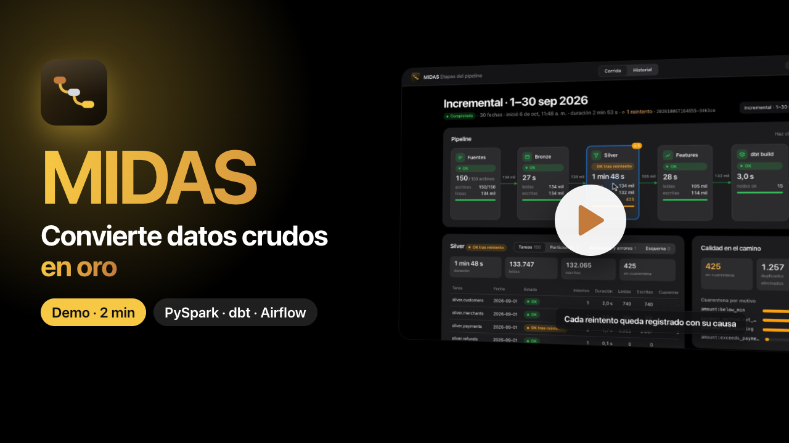
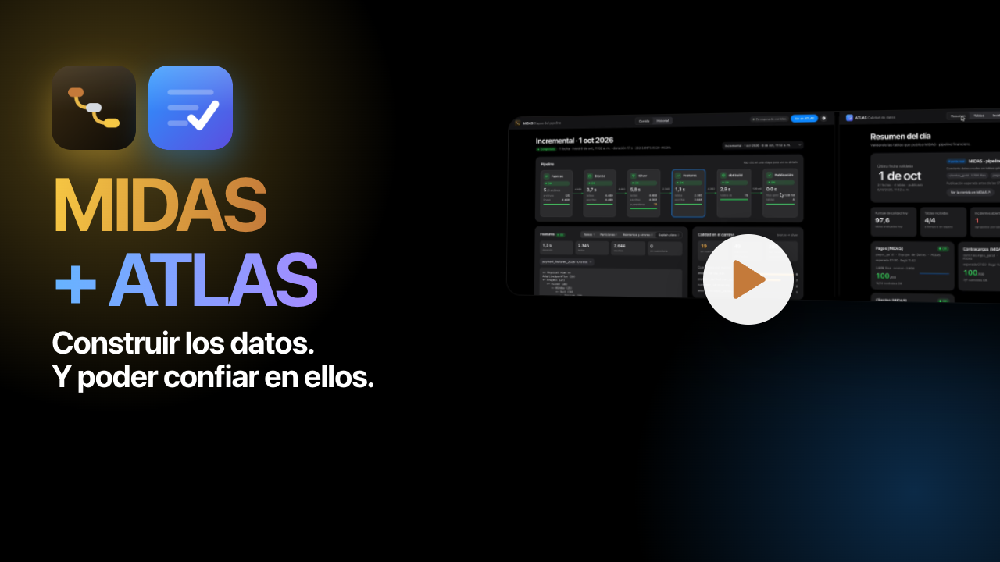
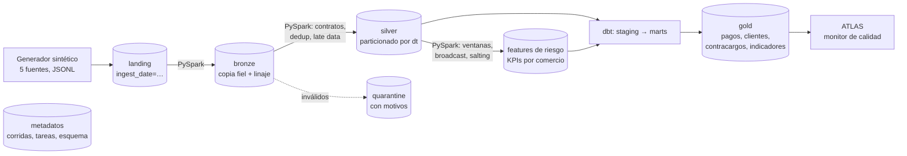

# MIDAS · Pipeline de datos financieros

**Convierte los datos crudos de una fintech en tablas gold confiables: landing → bronze → silver con PySpark → gold con dbt, orquestado con Airflow.**

[](https://github.com/diegosaaval/midas-data-pipeline/actions/workflows/ci.yml)
[](https://github.com/diegosaaval/midas-data-pipeline/actions/workflows/codeql.yml)




> 🇬🇧 *MIDAS turns raw fintech data (customers, merchants, payments, refunds, chargebacks) into trusted gold tables: landing → bronze → silver with PySpark (data contracts, quarantine, dedup, late-arriving data, schema evolution, idempotent partition overwrite) → gold with dbt (incremental models, tests), orchestrated by Airflow, with retries, backfills, run metrics and a live stage view. Monitored by [ATLAS](https://github.com/diegosaaval/atlas-data-quality).*

**¿Por qué MIDAS?** El rey Midas convertía en oro todo lo que tocaba. Este pipeline lleva los datos por bronze y silver hasta la capa **gold**. Pero el oro de Midas no siempre era lo que parecía: por eso existe su proyecto hermano, [ATLAS](https://github.com/diegosaaval/atlas-data-quality), que verifica que lo publicado sea oro de verdad.

> **MIDAS convierte datos crudos en oro; ATLAS verifica que sea oro de verdad.**

---

## Demo

| ▶️ MIDAS · 2 min | ▶️ MIDAS + ATLAS · 1:49 |
|---|---|
| [](https://youtu.be/KFIgQx3N6a8) | [](https://youtu.be/PXF2G3ek3ZU) |
| El dolor, bronze → silver → gold y un mes real con un reintento, cuarentena y explain plans. | Un pipeline en verde no significa datos correctos: la caída de la pasarela que solo ATLAS ve. |

🟢 **Demo en vivo:** [MIDAS · pantalla de etapas](https://midas-data-pipeline.onrender.com) + [ATLAS validándolo](https://atlas-midas.onrender.com) *(si llevan rato sin visitas, tardan cerca de un minuto en despertar)*

La demo web es una **vitrina**: Spark no cabe en un servidor gratuito, así que la pantalla de MIDAS repite en bucle una corrida real grabada (el mes con su reintento y el día en que se cae la pasarela, unos 4 minutos) y publica sus tablas gold y su manifiesto en `/vitrina/gold/`. ATLAS las lee por internet como si MIDAS estuviera corriendo: valida septiembre en verde, abre el incidente del 1 de octubre y su botón vuelve a la corrida que lo trajo. Los dos servicios están definidos en `render.yaml`.

**Pruébalo tú mismo: la historia completa, con las dos pantallas.** Clona los dos repositorios lado a lado:

```bash
git clone https://github.com/diegosaaval/midas-data-pipeline.git
git clone https://github.com/diegosaaval/atlas-data-quality.git
```

Y haz **doble clic en `Ver demo MIDAS + ATLAS.command`** (Mac) o **`Ver demo MIDAS + ATLAS.bat`** (Windows). La primera vez instala todo (Python 3.12 incluido si hace falta; para Spark se necesita Java 17+). Luego enciende ATLAS, lo conecta a MIDAS, abre las dos pantallas y cuenta la historia sola en unos 4 minutos (con `--pasos` avanza con Enter, para presentar en vivo):

1. **MIDAS procesa un mes** de una fintech. En la pantalla de etapas cada capa se enciende y las filas fluyen de una a otra; MIDAS aparta en cuarentena ~425 registros inválidos con su motivo, elimina ~1.250 duplicados e integra ~9.400 filas tardías a su fecha real.
2. **ATLAS valida lo publicado**: las 4 tablas gold con sus 23 reglas, en verde.
3. **El 1 de octubre se cae la pasarela de tarjetas**: 2 de cada 3 pagos con tarjeta se rechazan. Cada registro es válido, así que MIDAS lo publica con todo en OK.
4. **ATLAS detecta lo que ninguna regla podía ver**: la tasa de aprobación cae de 0,92 a 0,59 (7σ por debajo de lo normal) y abre un incidente para el responsable.
5. **Del incidente a la corrida que lo trajo**: el botón de ATLAS abre MIDAS justo en esa corrida.

Desde la terminal es lo mismo con `make show` (o `make show AUTO=1`, con pausas fijas para grabar). Si solo quieres ver MIDAS, doble clic en `Iniciar MIDAS.command` / `.bat`: abre la pantalla de etapas y, la primera vez, corre un mes de datos para que lo veas avanzar.

## El problema

Una fintech recibe cada día archivos de cinco sistemas: clientes, comercios, pagos, devoluciones y contracargos. Esos archivos **nunca llegan perfectos**:

| Problema real | Qué hace MIDAS |
|---|---|
| El mismo pago llega dos veces, o llega `pending` y al otro día `approved` | **Deduplicación** por llave de negocio: gana la versión más reciente (`updated_at`) |
| Pagos de hace 3 días aparecen en el archivo de hoy | **Datos tardíos**: se integran a la partición de su fecha real, sin reescribir el resto |
| Montos negativos, llaves vacías, valores fuera de catálogo, JSON corrupto | **Cuarentena** con el motivo de cada registro; nunca se pierde nada en silencio |
| La fuente agrega columnas nuevas (v2: `currency`, `channel`) o columnas no acordadas | **Evolución de esquema**: v1 y v2 conviven, los cambios no acordados se registran como evento |
| Un job falla a mitad de camino y hay que re-ejecutarlo | **Idempotencia**: re-procesar un día deja exactamente el mismo resultado |
| Hay que corregir un rango de fechas pasado | **Backfill** del rango, en orden cronológico |
| Una devolución mayor al pago original | **Reglas entre entidades** contra el pago original (con partition pruning) |
| Un comercio concentra 25% del volumen | **Skew**: salting en la agregación + AQE para joins sesgados |

## Arquitectura



| Capa | Qué contiene | Cómo se escribe |
|---|---|---|
| **landing** | Archivos tal como los entregan las fuentes | Fuera del pipeline (aquí, el generador) |
| **bronze** | Copia fiel en Parquet, todo como texto, + `_source_file`, `_ingested_at`, `_row_hash` | Sobrescribe solo la partición `ingest_date` del día |
| **silver** | Datos tipados, validados y deduplicados. Hechos particionados por fecha del evento (`dt`); dimensiones como estado actual | Sobrescribe solo las particiones afectadas (*dynamic partition overwrite*) |
| **quarantine** | Registros rechazados, en JSON crudo, con la lista de motivos | Por `ingest_date` |
| **gold** | Modelos dbt: `fct_payments` (incremental), dimensiones, y 4 datasets publicados | dbt; un manifiesto `_manifest.json` por publicación |

**Orquestación.** Airflow 3 ejecuta un DAG diario (`catchup=True`, `max_active_runs=1`) con reintentos y backoff exponencial. Cada tarea llama al CLI `midas task …`, así que toda la lógica vive en Python probado y el DAG queda delgado.

## Lo que demuestra en PySpark

| Técnica | Dónde |
|---|---|
| Window functions (`row_number`, rango de 7 días por cliente, `lag`) | `jobs/silver.py` (dedup), `jobs/features.py` (velocidad, montos atípicos) |
| Broadcast join | Validar comercios en pagos; enriquecer features con comercio |
| Partition pruning | Leer solo las particiones afectadas por datos tardíos o por la ventana de devoluciones (verificado en el plan físico) |
| Agregaciones + manejo de skew | KPIs por comercio con *salting* de la llave caliente + AQE `skewJoin` |
| `repartition` / `coalesce` | Un archivo por partición: evita miles de archivos pequeños en el lake |
| Explain plans | Se guardan en `data/meta/plans/` en cada corrida |
| Modo ANSI de Spark 4 | `try_cast` / `try_to_timestamp`: un valor malo va a cuarentena en vez de tumbar el job |

## Lo que demuestra en dbt

- **staging → marts → gold**, con SQL portable (macros `dbt.dateadd`, `dbt.datediff`) para correr igual en DuckDB y en Athena.
- `fct_payments` **incremental** con ventana de reproceso de 7 días: absorbe datos tardíos y cambios de estado sin reconstruir la historia.
- **26 tests de datos**: unicidad, no nulos, valores aceptados, relaciones (con severidad `warn` para padres tardíos) y tests propios (devolución ≤ pago, tasas entre 0 y 1).
- Gold en español, listo para negocio y para ATLAS: `pagos_gold`, `clientes_gold`, `contracargos_gold`, `indicadores_financieros` (TPV, tasa de aprobación, ticket promedio, devoluciones, contracargos).

## Resultados de una corrida real (local)

Septiembre completo (30 días), escala 1.0, MacBook, Spark local. Es la corrida de los videos y de la demo web:

| Métrica | Valor |
|---|---|
| Archivos de las fuentes | 150 (5 sistemas × 30 días), 134 mil líneas |
| Enviados a cuarentena, cada uno con su motivo | 425 (418 pagos + 7 devoluciones) |
| Duplicados eliminados | 1.257 |
| Filas tardías integradas a su fecha | 9.444 |
| Pagos publicados en gold | 122.564 |
| Duración total (bronze → gold) | 2 min 53 s, incluido un reintento |
| Reintentos | 1 falla transitoria simulada en `silver.payments`, recuperada sola |

`midas status` muestra estas métricas por tarea en la terminal; la **pantalla de etapas** las muestra como un diagrama en vivo.

## Pantalla de etapas

Cada corrida se ve como un pipeline: `Fuentes → Bronze → Silver → Features → dbt build → Publicación`.

- **Una tarjeta por etapa** con su estado (en espera, corriendo, OK, reintento, falla), duración y filas leídas, escritas y en cuarentena. Mientras la corrida avanza, la etapa activa se anima y las filas fluyen de una capa a la siguiente (se actualiza cada segundo).
- **Detalle al hacer clic:** tareas por entidad y fecha, particiones reescritas, reintentos con su error, eventos de esquema y los *explain plans* de Spark guardados en `data/meta/plans/`.
- **Calidad en el camino:** registros en cuarentena por motivo, duplicados eliminados y filas tardías integradas.
- **Historial:** incrementales, backfills y re-procesos, con un gráfico de duración por etapa a lo largo del tiempo.
- **Ver en ATLAS:** se habilita cuando termina la publicación.

Cómo abrirla:

- **Doble clic** en `Iniciar MIDAS.command` (Mac) o `Iniciar MIDAS.bat` (Windows). La primera vez instala todo, crea un acceso directo «MIDAS» con su ícono en el escritorio y, si no hay datos, corre la demo de 30 días para que la veas avanzar.
- **Terminal:** `midas ui` (o `make ui`) y luego `midas run` en otra terminal.

La pantalla **solo lee** `data/meta/midas.db` (tablas `runs`, `task_runs`, `schema_events`, `watermarks`), que se abre en modo de solo lectura: no cambia nada del pipeline. Es FastAPI más HTML, CSS y JavaScript sin compilación, con gráficos SVG propios, modo claro y oscuro. API documentada en `http://localhost:8100/docs`.

## Monitoreado por ATLAS

MIDAS produce los datos; [ATLAS](https://github.com/diegosaaval/atlas-data-quality) verifica que sean confiables. ATLAS lee las cuatro tablas gold (`data/lake/gold/*.parquet`) y vigila `_manifest.json`: cada vez que MIDAS publica, ATLAS valida las fechas nuevas con sus reglas (montos, estados, tasas entre 0 y 1, documentos, contracargos).

Para conectarlo, abre ATLAS y elige **MIDAS** en su botón *Fuente de datos*, o arráncalo con `./start.sh --fuente midas`.

**Un incidente de punta a punta** (`make incidente`, después de `make demo`; o completo con `make show`). El 1 de octubre la pasarela de tarjetas falla y rechaza 2 de cada 3 pagos con tarjeta. Cada registro es válido (estado `declined`, monto correcto, cliente existente), así que el contrato de MIDAS no tiene nada que rechazar y lo publica. ATLAS compara el día con su historia: la tasa de aprobación cae de 0,92 a 0,59 (7,2σ por debajo de lo normal) y abre un incidente para el responsable. Es la división de trabajo entre los dos proyectos: **MIDAS detiene los registros que incumplen las reglas que conoce; ATLAS detecta lo que ninguna regla por registro puede ver.**

**Contrato.** Cada publicación mantiene en el manifiesto `published_at` (ISO 8601 con zona horaria), `dates`, `run_id` y `datasets` (filas por tabla), y las columnas sobre las que ATLAS tiene reglas. Además incluye `kind` (incremental, re-proceso o backfill) y `quality` (registros en cuarentena por motivo, duplicados eliminados y filas tardías), y la pantalla de etapas abre cualquier corrida con `http://localhost:8100/#run=<run_id>`. `tests/test_atlas_contract.py` lo verifica: si un cambio lo rompe, el CI falla antes de que el monitoreo se entere.

## Cómo correrlo

**Local** (Python 3.11–3.13 y Java 17+):

```bash
make install     # crea .venv con uv e instala el paquete
make demo        # genera 30 días, corre el pipeline completo y muestra el estado
make ui          # abre la pantalla de etapas en http://localhost:8100
```

Comandos útiles:

```bash
midas generate --start 2026-09-01 --end 2026-09-30   # simular las fuentes
midas run                                           # incremental: solo fechas nuevas (watermark)
midas run --date 2026-09-10                         # re-procesar un día (idempotente)
midas backfill --start 2026-09-05 --end 2026-09-08  # re-procesar un rango
MIDAS_FAIL=silver.payments:1 midas run --date 2026-09-10   # ver un reintento en acción
midas status                                        # métricas de las últimas corridas
make dbt-docs                                         # documentación de los modelos dbt
```

**Con Docker** (Airflow + Postgres + Spark):

```bash
docker compose up --build                 # Airflow en http://localhost:8080 → activar el DAG midas_daily
docker compose run --rm midas status    # CLI dentro del contenedor
```

## Cómo se prueba

```bash
make test        # 54 tests (PySpark + dbt reales + API de la pantalla + show) · cobertura 93%
```

Cada problema de ingeniería tiene un test con datos construidos a mano: cuarentena por motivo, dedup, datos tardíos sin tocar otras particiones (se verifica la fecha de modificación de los archivos), idempotencia, evolución de esquema, reglas entre entidades, partition pruning en el plan físico, reintentos, fallas permanentes, backfill sin mover el watermark y fuente faltante sin reintento. La API de la pantalla tiene sus propios tests (estado de cada etapa en vivo, reintentos, fallas, corridas interrumpidas, solo lectura) y el contrato con ATLAS se valida sobre una corrida real. El DAG se valida contra Airflow 3 real en CI.

CI (GitHub Actions): ruff, pytest con Spark y dbt (cobertura mínima 90%), `dbt parse`, prueba del DAG contra Airflow 3, `pip-audit`, CodeQL y build de las dos imágenes Docker (Airflow y la vitrina, con prueba de humo). Las alertas de seguridad de GitHub vigilan las dependencias. Detalle en [SECURITY.md](SECURITY.md).

## Costos (diseño en AWS)

Con el volumen de este proyecto el costo es casi nulo. Medido: 34 días ocupan 38 MB de JSON crudo y 29 MB en el lake en Parquet (bronze + silver + gold).

- **S3**: centavos de dólar al mes; reglas de ciclo de vida mandan bronze antiguo a almacenamiento infrecuente.
- **Glue**: jobs PySpark de 2 DPU por ~3 minutos al día ≈ 0,1 DPU-hora × USD 0,44 ≈ **USD 0,04 por corrida** (~USD 1,3 al mes). Es el componente dominante.
- **Athena**: se cobra por datos escaneados; el particionado por `dt` y Parquet columnar reducen el escaneo a solo lo consultado. El workgroup tiene un límite de bytes por consulta.
- **Airflow**: local o MWAA. MWAA tiene un costo fijo alto; para un volumen así, EventBridge + Step Functions o un Airflow pequeño en contenedor son más baratos.

Detalle de decisiones y alternativas en [docs/DECISIONES.md](docs/DECISIONES.md).

## Estructura

```
src/midas/
  contracts.py      contratos de datos (columnas, tipos, reglas, llave de negocio, versiones)
  generator.py      fuentes sintéticas determinísticas con problemas reales inyectados
  jobs/bronze.py    landing → bronze
  jobs/silver.py    bronze → silver (+ cuarentena)
  jobs/features.py  features de riesgo y KPIs por comercio (ventanas, broadcast, salting)
  pipeline.py       runner: incremental, por fecha, backfill, reintentos, dbt, publicación
  metadata.py       registro de corridas, tareas, eventos de esquema y watermark
  cli.py            interfaz de línea de comandos (la usa Airflow)
  show.py           demo en vivo de MIDAS + ATLAS (make show)
  ui/               pantalla de etapas: API de solo lectura (FastAPI) + web/ (HTML, CSS, JS)
  ui/vitrina.py     demo web: repite en bucle una corrida real y publica gold para ATLAS
dbt/                proyecto dbt (perfiles DuckDB local y Athena)
airflow/dags/       DAG diario
docker/             imagen de Airflow con Java + midas, e imagen liviana de la vitrina
render.yaml         demo web: la vitrina de MIDAS + ATLAS leyéndola por URL
tests/              56 tests
vitrina/            la corrida grabada que repite la demo web (~6 MB)
run.py              lanzador de doble clic (Iniciar MIDAS.command / .bat)
```

## Roadmap

- [x] **Fase 1: MVP local.** Generador, PySpark bronze/silver/features, dbt gold, Airflow, Docker, tests y CI.
- [x] **Integración con ATLAS.** ATLAS monitorea los cuatro datasets gold que publica MIDAS (contrato probado en CI).
- [x] **Pantalla de etapas.** Cada corrida como un diagrama en vivo, con detalle, calidad e historial.
- [x] **Demo web.** Vitrina en Render conectada con ATLAS, y videos.
- [ ] **Fase 2: AWS.** Lake en S3 (`s3a://`), tablas en Glue Catalog, consultas en Athena (perfil `aws` de dbt ya definido).
- [ ] **Fase 3: Terraform.** Buckets (cifrado, bloqueo público, ciclo de vida), roles IAM de mínimo privilegio, bases de Glue y workgroup de Athena.
- [ ] **Fase 4: dbt en Athena.** Marts financieros incrementales sobre Iceberg.
- [ ] **Fase 5: optimización.** Métricas de costo por corrida, compactación y comparación de planes.

## Autor

**Diego S** · Data Engineer · [GitHub](https://github.com/diegosaaval) · [LinkedIn](https://www.linkedin.com/in/diegosaaval/)

Proyecto personal con datos 100% sintéticos.

## Licencia

MIT
