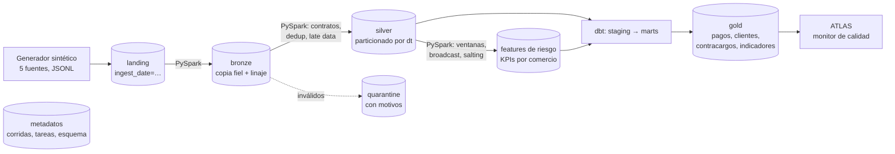

# FINFLOW · Pipeline de datos financieros

**Procesamiento diario de los datos de una fintech: de los archivos que entregan las fuentes a tablas gold confiables, con PySpark, dbt y Airflow.**


> 🇬🇧 *FINFLOW is a daily batch pipeline for synthetic fintech data (customers, merchants, payments, refunds, chargebacks): landing → bronze → silver with PySpark (data contracts, quarantine, dedup, late-arriving data, schema evolution, idempotent partition overwrite) → gold with dbt (incremental models, tests), orchestrated by Airflow, with retries, backfills and run metrics. Runs locally today; designed for S3 + Glue + Athena.*

Proyecto complementario de [ATLAS](https://github.com/diegosaaval/atlas-data-quality): **FINFLOW construye los datos, ATLAS verifica que sean confiables.**

---

## El problema

Una fintech recibe cada día archivos de cinco sistemas: clientes, comercios, pagos, devoluciones y contracargos. Esos archivos **nunca llegan perfectos**:

| Problema real | Qué hace FINFLOW |
|---|---|
| El mismo pago llega dos veces, o llega `pending` y al otro día `approved` | **Deduplicación** por llave de negocio: gana la versión más reciente (`updated_at`) |
| Pagos de hace 3 días aparecen en el archivo de hoy | **Datos tardíos**: se integran a la partición de su fecha real, sin reescribir el resto |
| Montos negativos, llaves vacías, valores fuera de catálogo, JSON corrupto | **Cuarentena** con el motivo de cada registro; nunca se pierde nada en silencio |
| La fuente agrega columnas nuevas (v2: `currency`, `channel`) o columnas no acordadas | **Evolución de esquema**: v1 y v2 conviven, los cambios no acordados se registran como evento |
| Un job falla a mitad de camino y hay que re-ejecutarlo | **Idempotencia**: re-procesar un día deja exactamente el mismo resultado |
| Hay que corregir un rango de fechas pasado | **Backfill** del rango, en orden cronológico |
| Una devolución mayor al pago original | **Reglas entre entidades** contra el pago original (con partition pruning) |
| Un comercio concentra 25% del volumen | **Skew**: salting en la agregación + AQE para joins sesgados |

## Arquitectura



| Capa | Qué contiene | Cómo se escribe |
|---|---|---|
| **landing** | Archivos tal como los entregan las fuentes | Fuera del pipeline (aquí, el generador) |
| **bronze** | Copia fiel en Parquet, todo como texto, + `_source_file`, `_ingested_at`, `_row_hash` | Sobrescribe solo la partición `ingest_date` del día |
| **silver** | Datos tipados, validados y deduplicados. Hechos particionados por fecha del evento (`dt`); dimensiones como estado actual | Sobrescribe solo las particiones afectadas (*dynamic partition overwrite*) |
| **quarantine** | Registros rechazados, en JSON crudo, con la lista de motivos | Por `ingest_date` |
| **gold** | Modelos dbt: `fct_payments` (incremental), dimensiones, y 4 datasets publicados | dbt; un manifiesto `_manifest.json` por publicación |

**Orquestación.** Airflow 3 ejecuta un DAG diario (`catchup=True`, `max_active_runs=1`) con reintentos y backoff exponencial. Cada tarea llama al CLI `finflow task …`, así que toda la lógica vive en Python probado y el DAG queda delgado.

## Lo que demuestra en PySpark

| Técnica | Dónde |
|---|---|
| Window functions (`row_number`, rango de 7 días por cliente, `lag`) | `jobs/silver.py` (dedup), `jobs/features.py` (velocidad, montos atípicos) |
| Broadcast join | Validar comercios en pagos; enriquecer features con comercio |
| Partition pruning | Leer solo las particiones afectadas por datos tardíos o por la ventana de devoluciones (verificado en el plan físico) |
| Agregaciones + manejo de skew | KPIs por comercio con *salting* de la llave caliente + AQE `skewJoin` |
| `repartition` / `coalesce` | Un archivo por partición: evita miles de archivos pequeños en el lake |
| Explain plans | Se guardan en `data/meta/plans/` en cada corrida |
| Modo ANSI de Spark 4 | `try_cast` / `try_to_timestamp`: un valor malo va a cuarentena en vez de tumbar el job |

## Lo que demuestra en dbt

- **staging → marts → gold**, con SQL portable (macros `dbt.dateadd`, `dbt.datediff`) para correr igual en DuckDB y en Athena.
- `fct_payments` **incremental** con ventana de reproceso de 7 días: absorbe datos tardíos y cambios de estado sin reconstruir la historia.
- **26 tests de datos**: unicidad, no nulos, valores aceptados, relaciones (con severidad `warn` para padres tardíos) y tests propios (devolución ≤ pago, tasas entre 0 y 1).
- Gold en español, listo para negocio y para ATLAS: `pagos_gold`, `clientes_gold`, `contracargos_gold`, `indicadores_financieros` (TPV, tasa de aprobación, ticket promedio, devoluciones, contracargos).

## Resultados de una corrida real (local)

34 días (1 sep – 4 oct), escala 1.0, MacBook, Spark local:

| Métrica | Valor |
|---|---|
| Registros de pagos leídos | 147.441 |
| Enviados a cuarentena | 476 pagos + 10 devoluciones |
| Duplicados eliminados | 1.427 |
| Filas tardías integradas a su fecha | 10.766 |
| Pagos en gold | 138.753 |
| Duración total (bronze → gold) | 2 min 42 s |
| Reintentos | 1 falla transitoria simulada en `silver.payments`, recuperada sola |

`finflow status` muestra estas métricas por tarea en la terminal; la **pantalla de etapas** las muestra como un diagrama en vivo.

## Pantalla de etapas

Cada corrida se ve como un pipeline: `Fuentes → Bronze → Silver → Features → dbt build → Publicación`.

- **Una tarjeta por etapa** con su estado (en espera, corriendo, OK, reintento, falla), duración y filas leídas, escritas y en cuarentena. Mientras la corrida avanza, la etapa activa se anima y las filas fluyen de una capa a la siguiente (se actualiza cada segundo).
- **Detalle al hacer clic:** tareas por entidad y fecha, particiones reescritas, reintentos con su error, eventos de esquema y los *explain plans* de Spark guardados en `data/meta/plans/`.
- **Calidad en el camino:** registros en cuarentena por motivo, duplicados eliminados y filas tardías integradas.
- **Historial:** incrementales, backfills y re-procesos, con un gráfico de duración por etapa a lo largo del tiempo.
- **Ver en ATLAS:** se habilita cuando termina la publicación.

Cómo abrirla:

- **Doble clic** en `Iniciar FINFLOW.command` (Mac) o `Iniciar FINFLOW.bat` (Windows). La primera vez instala todo, crea un acceso directo «FINFLOW» con su ícono en el escritorio y, si no hay datos, corre la demo de 30 días para que la veas avanzar.
- **Terminal:** `finflow ui` (o `make ui`) y luego `finflow run` en otra terminal.

La pantalla **solo lee** `data/meta/finflow.db` (tablas `runs`, `task_runs`, `schema_events`, `watermarks`), que se abre en modo de solo lectura: no cambia nada del pipeline. Es FastAPI más HTML, CSS y JavaScript sin compilación, con gráficos SVG propios, modo claro y oscuro. API documentada en `http://localhost:8100/docs`.

## Monitoreado por ATLAS

FINFLOW construye los datos; [ATLAS](https://github.com/diegosaaval/atlas-data-quality) verifica que sean confiables. ATLAS lee las cuatro tablas gold (`data/lake/gold/*.parquet`) y vigila `_manifest.json`: cada vez que FINFLOW publica, ATLAS valida las fechas nuevas con sus reglas (montos, estados, tasas entre 0 y 1, documentos, contracargos).

Para conectarlo, abre ATLAS y elige **FINFLOW** en su botón *Fuente de datos*, o arráncalo con `./start.sh --fuente finflow`.

**La demo de los dos, en un comando.** Con ATLAS abierto (`cd ../atlas-one && ./start.sh --fuente finflow`):

```bash
make show          # presenta paso a paso: Enter para avanzar
make show AUTO=1   # pausas fijas, para grabar un video
```

Abre las dos pantallas, procesa el mes desde cero, deja que ATLAS lo valide, provoca el incidente y termina en la corrida que lo trajo. Al reiniciar, la última publicación gold se conserva hasta que la nueva la reemplace: ATLAS nunca ve tablas a medio escribir.

**Un incidente de punta a punta** (`make incidente`, después de `make demo`). El 1 de octubre la pasarela de tarjetas falla y rechaza 2 de cada 3 pagos con tarjeta. Cada registro es válido (estado `declined`, monto correcto, cliente existente), así que el contrato de FINFLOW no tiene nada que rechazar y lo publica. ATLAS compara el día con su historia: la tasa de aprobación cae de 0,92 a 0,59 (7,2σ por debajo de lo normal) y abre un incidente para el responsable. Es la división de trabajo entre los dos proyectos: **FINFLOW detiene los registros que incumplen las reglas que conoce; ATLAS detecta lo que ninguna regla por registro puede ver.**

**Contrato.** Cada publicación mantiene en el manifiesto `published_at` (ISO 8601 con zona horaria), `dates`, `run_id` y `datasets` (filas por tabla), y las columnas sobre las que ATLAS tiene reglas. Además incluye `kind` (incremental, re-proceso o backfill) y `quality` (registros en cuarentena por motivo, duplicados eliminados y filas tardías), y la pantalla de etapas abre cualquier corrida con `http://localhost:8100/#run=<run_id>`. `tests/test_atlas_contract.py` lo verifica: si un cambio lo rompe, el CI falla antes de que el monitoreo se entere.

## Cómo correrlo

**Local** (Python 3.11–3.13 y Java 17+):

```bash
make install     # crea .venv con uv e instala el paquete
make demo        # genera 30 días, corre el pipeline completo y muestra el estado
make ui          # abre la pantalla de etapas en http://localhost:8100
```

Comandos útiles:

```bash
finflow generate --start 2026-09-01 --end 2026-09-30   # simular las fuentes
finflow run                                           # incremental: solo fechas nuevas (watermark)
finflow run --date 2026-09-10                         # re-procesar un día (idempotente)
finflow backfill --start 2026-09-05 --end 2026-09-08  # re-procesar un rango
FINFLOW_FAIL=silver.payments:1 finflow run --date 2026-09-10   # ver un reintento en acción
finflow status                                        # métricas de las últimas corridas
make dbt-docs                                         # documentación de los modelos dbt
```

**Con Docker** (Airflow + Postgres + Spark):

```bash
docker compose up --build                 # Airflow en http://localhost:8080 → activar el DAG finflow_daily
docker compose run --rm finflow status    # CLI dentro del contenedor
```

## Cómo se prueba

```bash
make test        # 45 tests (PySpark + dbt reales + API de la pantalla) · cobertura 95%
```

Cada problema de ingeniería tiene un test con datos construidos a mano: cuarentena por motivo, dedup, datos tardíos sin tocar otras particiones (se verifica la fecha de modificación de los archivos), idempotencia, evolución de esquema, reglas entre entidades, partition pruning en el plan físico, reintentos, fallas permanentes, backfill sin mover el watermark y fuente faltante sin reintento. La API de la pantalla tiene sus propios tests (estado de cada etapa en vivo, reintentos, fallas, corridas interrumpidas, solo lectura) y el contrato con ATLAS se valida sobre una corrida real. El DAG se valida contra Airflow 3 real en CI.

CI (GitHub Actions): ruff, pytest con Spark y dbt, `dbt parse`, prueba del DAG y build de la imagen Docker.

## Costos (diseño en AWS)

Con el volumen de este proyecto el costo es casi nulo. Medido: 34 días ocupan 38 MB de JSON crudo y 29 MB en el lake en Parquet (bronze + silver + gold).


- **S3**: centavos de dólar al mes; reglas de ciclo de vida mandan bronze antiguo a almacenamiento infrecuente.
- **Glue**: jobs PySpark de 2 DPU por ~3 minutos al día ≈ 0,1 DPU-hora × USD 0,44 ≈ **USD 0,04 por corrida** (~USD 1,3 al mes). Es el componente dominante.
- **Athena**: se cobra por datos escaneados; el particionado por `dt` y Parquet columnar reducen el escaneo a solo lo consultado. El workgroup tiene un límite de bytes por consulta.
- **Airflow**: local o MWAA. MWAA tiene un costo fijo alto; para un volumen así, EventBridge + Step Functions o un Airflow pequeño en contenedor son más baratos.

Detalle de decisiones y alternativas en [docs/DECISIONES.md](docs/DECISIONES.md).

## Estructura

```
src/finflow/
  contracts.py      contratos de datos (columnas, tipos, reglas, llave de negocio, versiones)
  generator.py      fuentes sintéticas determinísticas con problemas reales inyectados
  jobs/bronze.py    landing → bronze
  jobs/silver.py    bronze → silver (+ cuarentena)
  jobs/features.py  features de riesgo y KPIs por comercio (ventanas, broadcast, salting)
  pipeline.py       runner: incremental, por fecha, backfill, reintentos, dbt, publicación
  metadata.py       registro de corridas, tareas, eventos de esquema y watermark
  cli.py            interfaz de línea de comandos (la usa Airflow)
  show.py           demo en vivo de FINFLOW + ATLAS (make show)
  ui/               pantalla de etapas: API de solo lectura (FastAPI) + web/ (HTML, CSS, JS)
dbt/                proyecto dbt (perfiles DuckDB local y Athena)
airflow/dags/       DAG diario
docker/             imagen de Airflow con Java + finflow
tests/              47 tests
run.py              lanzador de doble clic (Iniciar FINFLOW.command / .bat)
```

## Roadmap

- [x] **Fase 1: MVP local.** Generador, PySpark bronze/silver/features, dbt gold, Airflow, Docker, tests y CI.
- [ ] **Fase 2: AWS.** Lake en S3 (`s3a://`), tablas en Glue Catalog, consultas en Athena (perfil `aws` de dbt ya definido).
- [ ] **Fase 3: Terraform.** Buckets (cifrado, bloqueo público, ciclo de vida), roles IAM de mínimo privilegio, bases de Glue y workgroup de Athena.
- [ ] **Fase 4: dbt en Athena.** Marts financieros incrementales sobre Iceberg.
- [ ] **Fase 5: optimización.** Métricas de costo por corrida, compactación y comparación de planes.
- [x] **Fase 6: integración con ATLAS.** ATLAS monitorea los cuatro datasets gold que publica FINFLOW (contrato probado en CI).
- [x] **Pantalla de etapas.** Cada corrida como un diagrama en vivo, con detalle, calidad e historial.

## Licencia

MIT
